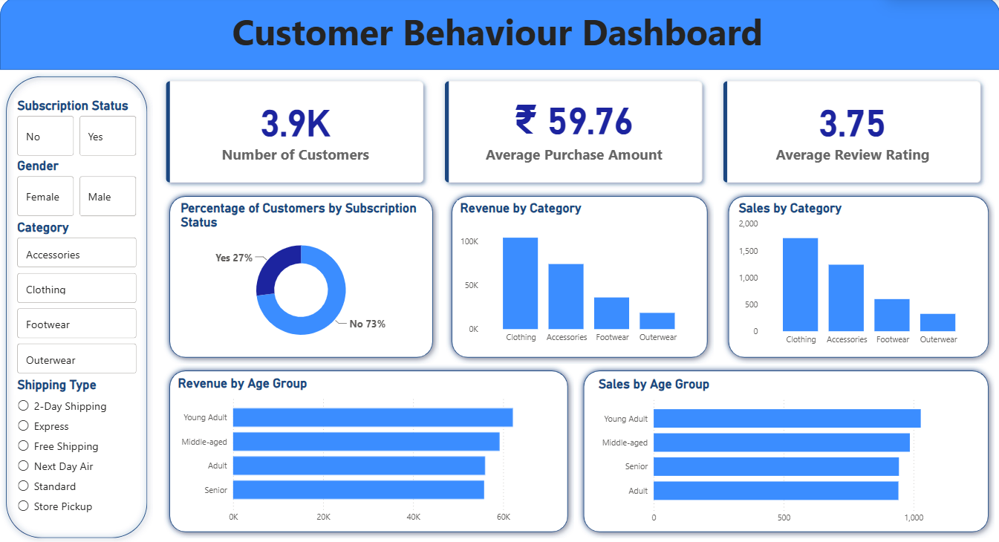

# Customer Shopping Behavior Analysis

## Overview

This project analyzes customer shopping behavior using transactional purchase data to uncover insights into customer demographics, purchasing patterns, product preferences, subscription behavior, and revenue performance.

The project follows a complete data analytics workflow, including data cleaning and exploration in Python, business analysis using PostgreSQL, dashboard development in Power BI, and presentation of findings through a business report and Gamma presentation.

---

## Dataset

The dataset contains customer shopping transactions across multiple product categories.

### Dataset Summary

* **Rows:** 3,900
* **Columns:** 18

### Key Features

* Customer Demographics (Age, Gender, Location)
* Subscription Status
* Product Category and Item Purchased
* Purchase Amount
* Discounts and Promotions
* Review Ratings
* Purchase Frequency
* Shipping Type
* Seasonal Purchase Information

---

## Tools & Technologies

| Tool                                        | Purpose                                   |
| ------------------------------------------- | ----------------------------------------- |
| Python (Pandas, NumPy, Matplotlib, Seaborn) | Data Cleaning & Exploratory Data Analysis |
| PostgreSQL                                  | Data Storage & SQL Analysis               |
| Power BI                                    | Interactive Dashboard Development         |
| Gamma AI                                    | Business Presentation Creation            |
| GitHub                                      | Project Documentation & Version Control   |

---

## Project Workflow

### 1. Data Loading & Exploration (Python)

* Loaded dataset using Pandas
* Performed initial exploration using:

  * `info()`
  * `describe()`
  * Missing value analysis
* Checked data quality and structure

### 2. Data Cleaning & Preparation

* Handled missing values in Review Rating
* Standardized column names using snake_case
* Removed redundant columns
* Validated data consistency
* Created additional analytical features:

  * Age Groups
  * Purchase Frequency Metrics

### 3. Exploratory Data Analysis (EDA)

* Customer demographic analysis
* Purchase behavior analysis
* Product category performance
* Subscription behavior insights
* Revenue trend exploration
* Discount and promotion analysis

### 4. PostgreSQL Analysis

Cleaned data was loaded into PostgreSQL for business-focused SQL analysis.

Key analyses performed:

* Revenue by Gender
* High-Spending Discount Users
* Top Rated Products
* Shipping Type Performance
* Subscribers vs Non-Subscribers Analysis
* Discount-Dependent Products
* Customer Segmentation
* Top Products by Category
* Repeat Buyer Analysis
* Revenue Contribution by Age Group

### 5. Power BI Dashboard

Built an interactive dashboard to visualize key business metrics and customer insights.


Dashboard highlights:

* Revenue Overview
* Customer Segmentation
* Category Performance
* Subscription Analysis
* Age Group Analysis
* Discount Impact Analysis
* Product Performance Metrics

### 6. Reporting & Presentation

* Created a detailed business analysis report
* Documented insights and recommendations
* Designed a stakeholder presentation using Gamma AI

---

## Dashboard

The Power BI dashboard provides an interactive view of:

* Customer purchasing behavior
* Revenue distribution
* Product category performance
* Subscription trends
* Customer segments
* Discount effectiveness

---

## Key Insights & Results

* Identified high-revenue customer segments
* Analyzed subscriber vs non-subscriber spending patterns
* Discovered top-performing products and categories
* Evaluated the impact of discounts on purchasing behavior
* Assessed revenue contribution across age groups
* Explored customer loyalty and repeat purchase trends

### Business Recommendations

* Promote subscription benefits to increase customer retention
* Introduce loyalty programs for repeat buyers
* Optimize discount strategies to balance revenue and profitability
* Focus marketing efforts on high-value customer segments
* Highlight top-rated products in promotional campaigns

---

## Project Structure

```text
Customer-Behavior-Analysis/
│
├── Dataset/
├── Python/
│   ├── data_cleaning.ipynb
│   ├── eda.ipynb
│
├── SQL/
│   ├── sql_queries.sql
│
├── PowerBI/
│   ├── dashboard.pbix
│
├── Report/
│   ├── Customer_Shopping_Behavior_Analysis.pdf
│
├── Presentation/
│   ├── Gamma_Presentation.pdf
│
└── README.md
```

---

## How to Run

### Python Analysis

1. Clone the repository
2. Install required libraries

```bash
pip install pandas numpy matplotlib seaborn sqlalchemy psycopg2
```

3. Run the Python notebooks/scripts for data cleaning and EDA.

### PostgreSQL Analysis

1. Create a PostgreSQL database
2. Import the cleaned dataset
3. Execute the SQL queries provided in the SQL folder

### Power BI Dashboard

1. Open the `.pbix` file in Power BI Desktop
2. Refresh the data connection if required
3. Explore the interactive dashboard

---

## Author

**Data Analyst Portfolio Project**

End-to-end Customer Shopping Behavior Analysis using Python, PostgreSQL, Power BI, and Gamma AI to transform raw transactional data into actionable business insights.
